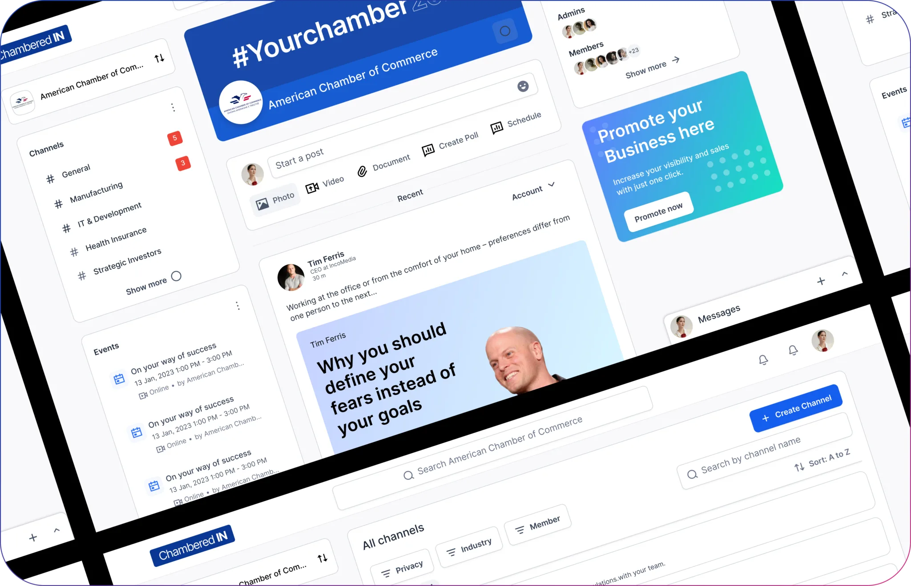

<div align="center">

# Eljo Hoxha

### Senior React Native Engineer · Mobile Architect · Cross-Platform Product Builder

I architect and deliver production applications across iOS, Android, and web—turning complex product workflows into scalable, maintainable software.

[Email](mailto:eljohoxha15@gmail.com) · [LinkedIn](https://linkedin.com/in/eljo-hoxha-70915b279) · [Résumé](src/assets/cv/eljo-hoxha-cv.pdf)

**5+ years building products · 9 production platforms · iOS + Android + Web**

</div>



## What I Bring

- Independent ownership of architecture, technical decisions, implementation, and delivery
- Production React Native applications spanning iOS, Android, and web
- Complex product integrations including payments, subscriptions, maps, notifications, deep linking, and real-time messaging
- Major React Native, Expo, React, routing, and TypeScript migrations
- Shared component systems, multi-application monorepos, and white-label foundations
- Release-ready execution with EAS Build, EAS Update, and automated delivery workflows

## Flagship Work — ChamberedIn

As the sole Senior React Native engineer responsible for ChamberedIn's events domain, I owned the complete technical direction and mobile implementation across iOS and Android.

I transformed a monolithic event workflow into a modular, role-aware system covering:

- Event creation and editing across Details, Schedule, Location, Pricing, and Settings
- Timed, all-day, recurring, and time-zone-aware scheduling
- Online, in-person, and hybrid event experiences
- Google Calendar and Microsoft connected-app flows
- Stripe tickets and recurring per-session subscriptions
- Refunds, cancellations, attendees, host sessions, and revenue reporting
- Calendar, agenda, grouped-list, filtering, and administrative experiences

**Core stack:** React Native, Expo, TypeScript, Expo Router, Apollo GraphQL, Zustand, React Hook Form, Zod, Stripe, Tamagui, Firebase, Reanimated, and FlashList.

## Selected Projects

| Project | Role | Key contribution | Platforms |
|---|---|---|---|
| **ChamberedIn** | Senior React Native Developer — Events Lead | Sole ownership of the events architecture and complete mobile lifecycle | iOS, Android |
| **One Home Solution** | React Native / Expo Engineer | Two-application monorepo, shared design system, and coordinated Expo SDK 53 migration | iOS, Android, Web |
| **Wrent** | React Native / React Frontend Engineer | Two-sided rental marketplace with Stripe Connect, maps, messaging, and administration | iOS, Android, Web |
| **Power of Two** | Senior Frontend Developer | Independently designed a mobile-first campaign and commerce platform with deep linking and payments | iOS, Android, Web |
| **NOV8** | Vue Frontend Developer | Learned Vue rapidly and delivered a product-sized AI SaaS frontend in its initial three-week phase | Web |
| **Paramount Pulse Access** | Lead React Native Developer | Modernized an 8,000+ line legacy application into a strict TypeScript, Expo, and multi-brand foundation | iOS, Android |
| **Motomtech Portal** | Frontend Developer | Role-based operations portal for projects, staff, billing, contracts, and documents | Web |
| **KidsPod** | React Native Mobile Developer | Audio playback, subscriptions, downloads, deep linking, and native integrations | iOS, Android |
| **Poro** | Frontend Web & Mobile Developer | Multi-role food delivery journeys for customers, drivers, and restaurant operations | iOS, Android, Web |

## Engineering Capabilities

| Area | Technologies and practices |
|---|---|
| **Mobile & cross-platform** | React Native, Expo, Expo Router, React Native Web, EAS Build, EAS Update |
| **Frontend** | React, Vue 3, TypeScript, Tailwind CSS, Tamagui, responsive design systems |
| **Architecture** | Mobile architecture, monorepos, reusable modules, white-label platforms, domain-based structure |
| **Data & state** | TanStack Query, Zustand, Apollo Client, GraphQL, REST APIs, generated types |
| **Forms & validation** | React Hook Form, VeeValidate, Zod, conditional and role-aware validation |
| **Product integrations** | Stripe, Stripe Connect, Firebase, Socket.IO, maps, notifications, deep linking |
| **Quality & delivery** | Vitest, Jest, GitHub Actions, EAS releases, OTA updates, dependency migrations |

## How I Work

1. **Own the outcome, not only the ticket.** I connect product requirements to technical decisions and carry features through delivery.
2. **Build typed foundations.** I use clear domain boundaries, reusable modules, schema validation, and generated API types.
3. **Design around real workflows.** Architecture should make complex user journeys easier to understand, extend, and maintain.
4. **Respect each platform.** Shared code is valuable, but iOS, Android, and web still need intentional behavior and interaction design.
5. **Make releases predictable.** Builds, migrations, environment configuration, and updates are part of the product—not afterthoughts.

## This Portfolio

The portfolio itself is built with React 19, TypeScript, Vite, TanStack Router, Tailwind CSS, React Three Fiber, Three.js, and Lucide React.

```text
src/
├── assets/       # Project imagery and visual assets
├── components/   # Shared React components
├── data/         # Typed project and case-study content
├── routes/       # Portfolio and project-detail routes
├── types/        # Shared TypeScript models
└── styles.css    # Global visual system
```

### Run locally

```bash
npm install
npm run dev
```

Open `http://127.0.0.1:5173`.

```bash
npm run build    # Type-check and create a production build
npm run preview  # Preview the production build locally
```

## Let's Build Something Substantial

I am interested in senior React Native opportunities involving architecture, technical ownership, and complex cross-platform products.

**[Get in touch](mailto:eljohoxha15@gmail.com)** or connect with me on **[LinkedIn](https://linkedin.com/in/eljo-hoxha-70915b279)**.
